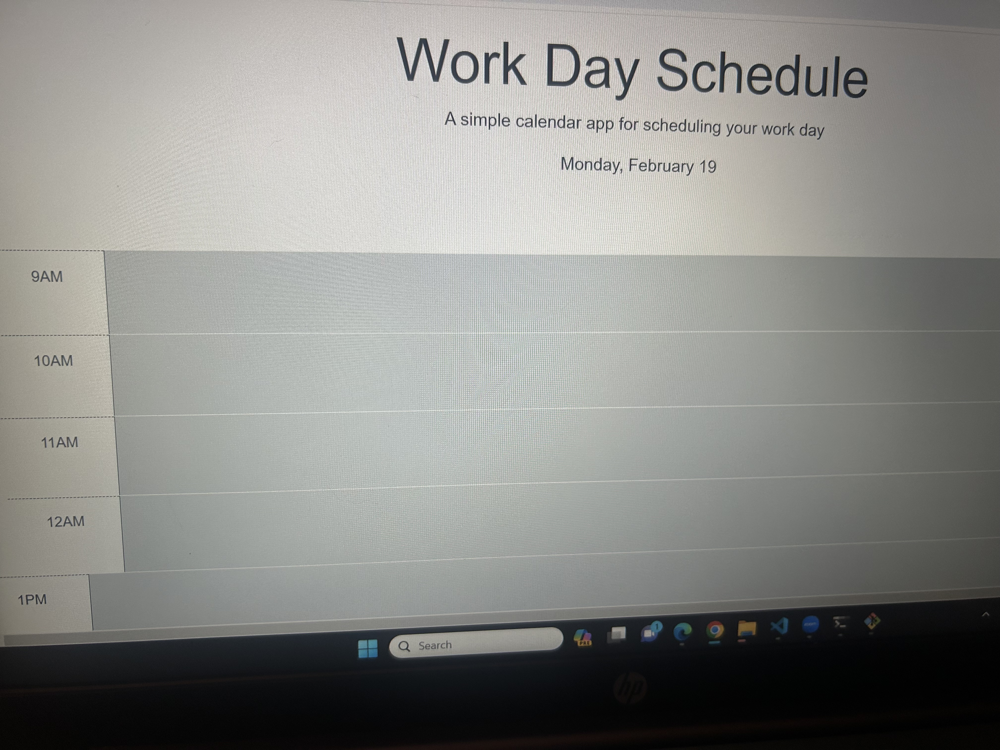

Link to Repository: https://github.com/Watsonaj0316/scheduler-1 

Link to Deployed Application:
https://watsonaj0316.github.io/scheduler-1/ 

Features: User can schedule tasks and events during their work day and save reminders to stay organized.

General info: The scheduler changes colors based on the time of the day. Red color is present time, green color is future time, and gray color is past time.

Screenshot of the  following application:

 
